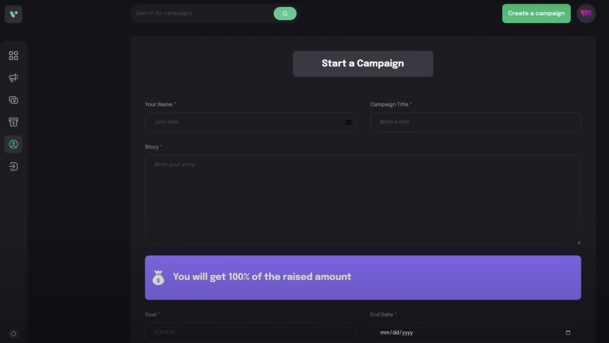
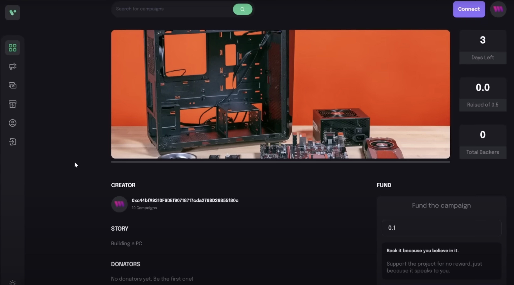
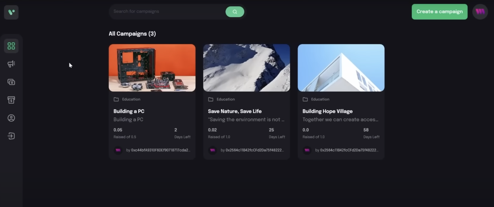

# a Web3 Blockchain Crowdfunding Platform

# With a stunning design, connected to the blockchain, metamask pairing, interaction with smart contracts, sending Ethereum through the blockchain network, writing solidity code, and the ability to create, view, and donate to crowdfunding campaigns directly through the blockchain

